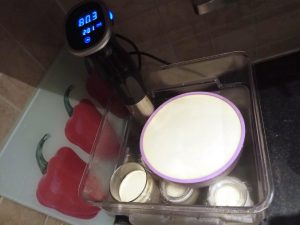
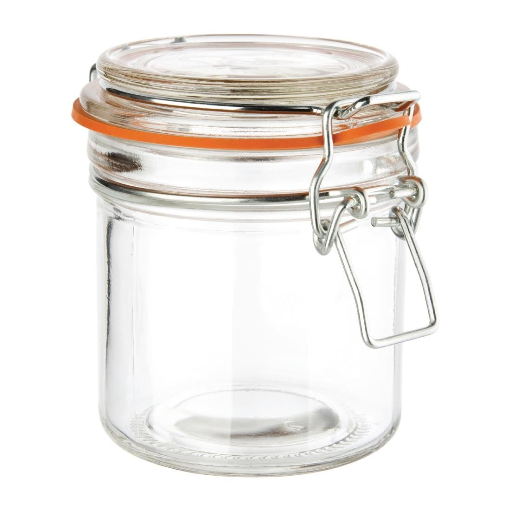
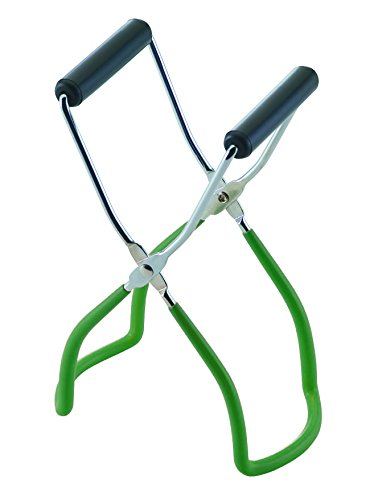

This cheesecake is delicious, light, delicately flavoured and almost certainly won't break during cooking.  Because the sousvide bath will not overheat any part of the cake there will be no Maillard reaction and no browning, drying or unwanted textures.

You can also get creative with toppings and because nothing will go over 80 degrees celsius there is lots of scope for adding chocolate or other ingredients into the batter.

The ingredients listed give a mild lemon flavour and a hint of vanilla, but this is also a great place to use a small amount of tincture of star anise or purée of passionfruit (Seeds removed.) Be careful though not to add too much fluid to the batter which might prevent it from setting.

# Equipment

In addition to the kitchen basics you will need this equipment:

A silicone cake mould 20 by 6 cm round or about 1.9 litre capacity, of material that will float. This must be water-tight;

Electric hand mixer (The egg beater kind, not the stick blender kind);

A teflon sheet and a flat board for turning out the cake;

Foodsafe latex gloves to prevent the base sticking to your hands.

## For the cake

600 g full fat cream cheese (Do not use reduced fat cheese, it will make a dramatically inferior cake);

1 tablespoon greek yoghurt or crème fraîce (Optional);

50 g icing or castor sugar or equivalent sweetener;

3 eggs;

I tablespoon vanilla extract;

Zest of 2 lemons or more as desired.

## For the base

200g shortcake biscuits (Or digestive);

80g ground almonds;

1g cinnamon;

100g butter.

# Method

Heat a Sous Vide bath to 80 degrees celsius. Start with fresh water as the top of the cake won't be covered.

Finely crumb the biscuits in a food processor, adding cinnamon. Soften the butter until very soft but not liquid, and combine with the biscuit crumbs and ground almonds. Apply latex gloves and work the biscuit mixture with your fingers for 5 minutes until evenly distributed. Press the mixture into the base of the cake mould by hand or using the bottom of a glass, or spoon, or similar.

Clean the bowl for reuse and combine the lemon zest, cream cheese, greek yogurt (Optional), sugar or sweetener, eggs, vanilla extract. Begin beating with an electric mixer. The mixture will be liquid and you may taste for suitable flavour (Remembering it contains raw eggs.)

Now pour the mixture over the base in the cake mould and float the mould into the water bath. It may be useful to place a drinking glass full of water beside or under the cake to stop it jostling around.

Normally you would cover a sousvide bath to reduce heat escaping, however this may cause droplets of water to drip from the lid onto the cake diluting the mixture. While a certain amount of this won't matter it is advisable to install a very clean tea towel under the lid and ensure the bath is not completely sealed to prevent dripping onto the cake.

Cook at 80 celsius for 1.5 to 2 hours. Remove the cake from the bath as soon as it's at a safe temperature and transfer it to the fridge, cover with the tea towel and leave overnight.

Now remove the cake from the mold. This is difficult unless you know how, so follow these directions carefully. Insert a blunt knife between the cake and inside of the mold and move it around with an up-and-down motion all around inside of the mold to free the sides of the cake and base to the bottom. When you are putting a knife or utensil in contact with the cake it may help to run it under the tap first and shake off excess water, this will help it slide against the cake better.

Now get a warm plate or any warm flat surface at not more than 80 celsius (Frying pan, contact grill, a cooker plate that is almost cool) and sit the mold on top of the heat for not more than a minute. This will melt the butter at the bottom of the base and unstick it from the mold.

Place a teflon sheet on a flat cutting board, invert it and place it on top of the cake, then re-invert it all so the cake turns out onto the sheet upside-down. Remove the mold and replace it with a plate and re-invert it without squashing it. Carefully peel the teflon sheet off the top of the cake.

Now you can slice your cake and apply cream, chocolate ganache, fruit coulis or your preferred topping (Or no topping at all) and serve.

# Mason Jar Variation

The same process can be adjusted to make cheesecake in Mason Jars. These can be obtained cheaply in Ikea. They must be the variety of jar that has a gasket to release high pressure even when closed. They are referred to as preserving jars.

Keep the base light, don't press it down too hard and put a heaped teaspoon in the bottom of each jar, then fill to the neck with the batter mixture. The quantity given in this recipe makes 6 jars of 300 ml size, 8 if you leave some room in the top for ganache or topping.

Reduce the cooking time to an hour.

A jar lifter is ideal for putting the jars into the water and getting them out again. When closed they can be fully submerged and will release pressure as the cheesecake cooks without letting any water in as this is what they are designed to do.

When the jars are done and removed from the water, open them a few minutes later and allow to cool in the fridge for 20 minutes, then seal the lid again. If you skip this step the jar will form a vacuum and your cheesecake will break up when you eventually open the jar. (The disadvantage to this step is that the contents are not sterile any more.) Allow to chill completely for some hours.

When you want to serve the cheesecakes remove them from the fridge and add any toppings.

Once cooked these transport very well, much easier than a full cake.
