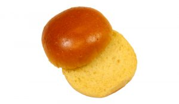
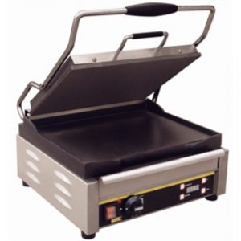
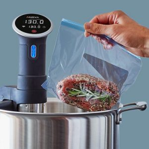
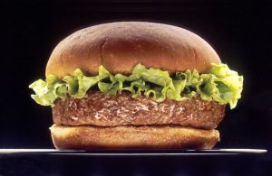

# Meat

To make perfect burgers your meat has to be right. It needs about 30% fat. If you are cooking sous vide as described below, you could get away with 20% because of the reduced cooking temperature.

Therein lies the problem though, any beef mince you buy in a supermarket is going to have a maximum of 10% fat, sometimes 5%, and may be labelled 'Lean Mince'. This will work fine in a Bolognese sauce or chilli, but it won't work for burgers. Burgers are 100% mince or very close, and the meat just has to be right, and it has to be 20% fat for sous vide, or 30% for frying or contact grilling.

So you can go to a butcher and buy the cuts of beef you need, and ask for some beef or pork fat, and take it all home and grind the correct proportions and press your burger patties. This may work very well, but it seems like a lot of work, because if your butcher is good he or she is perfectly capable of making a 20% fat burger on request. The reason they don't is because people don't ask or don't want them because, consciously or subconsciously they buy into the low fat message and are afraid to ask for any foods containing 20% fat!

So, ask your butchers if they can make a 20% or 30% fat burger, and if the answer is 'no' then just find a different butcher! The burgers you buy in restaurants are not made with 5% fat beef from the supermarket I assure you, and somebody is making those! If your butcher is good he or she is probably making restaurant quality burgers for use in restaurants and gastropubs  and will sell them to you as well.

# Bread

The choice of bread doesn't stop at sesame seed or plain burger bun. Next time you're in the bread aisle, check the best before dates on the burger bread. If it's a month or two away then it's full of preservatives and you don't want it, and that's not even counting the the time the supermarket took to get the product on the shelf. In short, burger buns are not treated the same way as fresh bread.

If you buy a kaiser roll you expect that to go off in a few days, not a few months, so that's the bread you need, and if you need to preserve it, well you freeze it! Try small crusty round rolls, 4 or 5 inch in diameter that are not _too_ hard or crunchy for soft burgers. Failing that a good quality brioche burger bun is a popular choice.

Bread should usually be lightly toasted on the cut side only and warmed through to bring out its flavour and the correct texture.

# Cooking the meat

Now here you have more choices. If you've found a butcher to make you a good burger, then this step is important but not as difficult as it might seem. There are three options. A salamander grill isn't one of them. A burger should not be grilled, that takes the flavour and fat away and is messy with a high fat meat, it will work but it won't give great results. Some burger chains grill their burgers, notably Burger King but it's safe to say the meat you're using is probably going to have more flavour, and you should keep that flavour locked in by cooking by means of contact, not radiant grilling.

## Fry

Heat the pan to 200 Celsius. Use a nonstick pan and you won't need oil. Put the burgers in. If the temperature is correct you won't see any splattering or sizzling, that indicates a pan that is too hot. Let them cook for a few minutes before touching them at all, as this allows the surface to cook and the nonstick coating to work. Turn them and do the same on the other side. When both sides are seared brown turn you attention to the doneness of the meat by inserting a meat thermometer through the side and into the very centre of the patty to see the temperature.

| Through Temperature | Doneness |
| --- | --- |
| 50 | Rare |
| 56 | Medium rare |
| 61 | Medium |
| 67 | Medium well |
| 72 | Well |

This will help you get your timing right and with practice, and assuming you're using the same burgers each time, you won't need to measure every one.

But there's a problem. The European Food Safety Authority (ESFA) and the United States Department of Agriculture (USDA) say that meat cooked in the home should be cooked to 65 and 71 Celsius respectively. By those guidelines the only kind of burgers you can cook are well done or medium well. For this reason, many people who fry burgers simply don't follow the guideline. This is why a better cooking method is required, and as it happens, I've described one below.

## Contact Grilling

Contact grilling works just like frying. It can be more convenient because the temperature is controlled thermostatically, and it cooks both sides of the meat at the same time. Closer temperature control produces less smoke and mess and makes the process repeatable.

Generally flat plates are better for burgers than ribbed plates, which are more suitable for sandwiches. Domestic machines may be nonstick, but commercial grade machines are cast iron or cast aluminum.

To cook burgers on a cast iron contact or surface grill, you need to be more careful and know a few things. First off, the grill must be at full temperature, 200 Celsius or more, when you apply the food, and there should be a small amount of oil applied to both top and bottom of the burger. Once applied to the plate the lid can be closed but not squashed down, and it should not be opened until the surface of the burger has seared as it will tear the patty in half. Only when the meat has seared for a minute or two is the surface anything like nonstick. The lid can be carefully opened and a thin tool used to unstick the patty.

If the plates of your contact grill cannot cope with burgers instead sticking and breaking and tearing them you may have to resort to a nonstick teflon sheet cut to size and applied to the grill surface. It's a shame to do so because cast iron has so many advantages as a cooking surface but you also need to make the process work. The good news is that temperature stability is a major advantage of a heavy cast iron cooking plate, and that advantage won't be lost.

Temperature control and doneness of the meat has to be controlled in the same way as for frying, with all the same food safety implications. So if you want a medium burger, you're going against EFSA and USDA guidelines.

## Sous Vide and Sear

As you may have guessed, I have saved the best for last.

Sous vide means 'under vacuum', which is not very descriptive of the process. It is a modern technique of food preparation that involves holding the temperature of the food exactly to within fractions of a degree for long periods. It's not unlike a Bain-marie but with very accurate temperature control. The food is vacuum sealed in a plastic bag and immersed in the water for a relatively long period at temperatures between 55 and 75 Celsius for meats and higher for vegetables.

When you sous vide you are using a process known as _science_, and it is delicious. The temperature chart used above still applies (Except for rare), but it means something different. You cannot sous vide meat at less than 54.5 Celsius, because that is the tipping point where most nasty bacteria stop growing and start dying, so you cannot sous vide a rare burger because at the extended cooking times required you will culture the bacteria instead of killing them. However if you use 54.5 Celsius you have a sort of rare-medium-rare and you won't die of botulism, so I consider that a good compromise.

Now for the crux of the issue: sous vide is the safest way to cook burgers in the range between rare-medium-rare and medium-well. You can have the food safety of a well done burger at rare-medium-rare doneness and a beautiful soft texture that is difficult to get reliably by any other means you're likely to use at home.

So what's involved? Essentially, you seal your burger in a plastic food-safe bag. You can vacuum seal it or use a zip lock bag and partly immerse the bag in water to expel the air. You then use a sous vide machine and set it to your desired temperature. The meat then cooks  for a long time at a relatively low temperature and once it's done your burger is not just safe to eat, it is actually pasteurised! For every 10 million bacteria that were previously in the meat there is now one. This is loftily referred to as _7log10 relative reduction of salmonella_.

A typical pasteurisation chart for beef looks like this:

| Temperature in C | Cooking duration after heating |
| --- | --- |
| 54.5 | 113 minutes |
| 57.3 | 36 minutes |
| 60.0 | 12 minutes |
| 62.8 | 4 minutes |
| 65.6 | 72 seconds |
| 68.4 | 24 seconds |
| 71.2 | 6 seconds |
| 73.9 | 3 seconds |

This does not include the time required for the meat to heat through to the prescribed temperature, which can take some time at 54.5 degrees. Burgers, being relatively thin, will require about 30 minutes. With sous vide you can't accidentally overcook so you should overestimate the time.

From this pasteurisation data you can definitely see why temperatures over 65 Celsius are recommended for home cooking by the European Food Safety Authority and even higher temperatures by the USDA. Cooking to a through temperature of more than 65 Celsius makes the meat very safe in just over a minute, but not safer than cooking at 54.5 Celsius for two hours. These guidelines however are targeted at amateur cooks so that they may cook meat dishes and live to tell the tale, and are conservative for that reason.

And here we come to the most beautiful thing about sous vide: because we're using science, the temperature we select on the sous vide cooker is what controls the doneness of the meat! It doesn't matter how long the meat stays in the sous vide after the minimum period has elapsed, it won't get more done. 2 hours, 3, 4, 5 it's all the same. Something like a steak will become more tender, softer and eventually squashy and unappetising if left in there in the order of 12 to 16 hours, and yes that matters, but it won't get more done! So once your burgers have served their time in the water, you can hold them at that temperature for an hour or two longer without worry, and they can't realistically get overdone. You can't turn a medium burger to medium-well unless you raise the temperature from 61 to 67 Celsius!

Thus the sous vide step could take up to 2.5 hours for rare-medium-rare at 54.5 Celsius, or as little as 40 minutes for well done at 72 Celsius. Once done you can unseal the burger patties and sear them on your pan or contact grill, remembering all that advice previously given about those methods. If possible you might even choose a temperature higher than 200 Celsius so that the burgers sear quickly giving them an appetising outward appearance but don't cook a whole lot more. Remember you are searing not cooking. You don't want those perfectly cooked patties on the grill more than a minute, less if possible, because you don't want to cook them any more and change their doneness.

This process will get you a very safe, almost rare burger, or medium or well as desired and nicely seared on the outside. Ostensibly it won't look a lot different, nor should it, but cut it open and you will see the perfect doneness of the inside, the texture is softer and the flavour is sublime.

## Dressing

To start with try a traditional salad dressed burger like the Burger King Whopper ®: Mayonnaise, iceberg lettuce, tomato, pickled cucumber, ketchup, fresh onion.

Cut a whole onion into rings and toss it in a little olive oil and fry or close it in the contact grill at 200 Celsius for 2 minutes which works very well, and you have softened fried onions.

Fried onions, ketchup or relish, cheese, streaky bacon or bacon medallion.

Run up a batch of chilli and top the patty with chilli and cheese melted. Or chilli and taco sauce.

Ketchup, mustard, pickled cucumber, onions optional.

Mayonnaise or aioli and blue cheese.

Mash an avocado with lime juice, bacon, BBQ sauce. This is particularly good served on a toasted pitta bread cut lengthwise.

Or any of hundreds of ideas others have shared on the internet.

# Conclusion

Having run out of things to say I just hope you're converted. Burgers aren't hard, and if you let your butcher do the heavy lifting you can concentrate on cooking, dressing and selecting the bread. Burgers are an acceptable food for a large percentage of the meat-eating population, and as long as you prepare them carefully and with some flair they'll usually impress all but the most snobbish guests. They're also easy to cook in bulk by the methods described and because they can be filled so many different ways they are an extremely versatile food.

I believe a good burger is something worth practicing. Once you get your cooking process down and select a shortlist of breads and fillings you'll be well prepared to treat your guests to a pleasant surprise when they realise that you've really made the humble burger into an artform.
