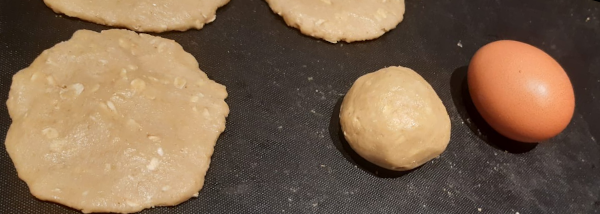

300 g Oat Flour (You can make this from rolled oats in a food processor if required)  
150 g Self-raising White Flour (Or Plain Flour with Half Level Teaspoon Baking Powder)  
100 g whole rolled oats (Optional)  
120 g Butter  
150 g Coconut Oil  
3 Medium Eggs  
2 tablespoons Canola or Sunflower Oil  
1 g Pure Sucralose or equivalent sweetener  
2 g Salt  
1 tbsp Vanilla Essence (Optional)

Theese cookies are sugar free a deliciously oaty and crumbly. The main advantage to this recipe is that it is very easy to prepare and the dough is easy to press because once mixed fully it doesn't stick to the hands.

The oils should be soft but they do not need to be melted. Simply mix all ingredients together until a soft pliant dough is achieved. You can add a very small splash of water near the end only if the dough is too hard to work.

Take a spoon full of dough and roll into a ball about the size of an egg. Then press between the palms of your hands and transfer to a non-stick baking sheet. Repeat to make about 18 to 20 cookies. Press down with a moistened fork.

Bake in a preheated fan oven at 190 C for about 10 minutes until golden but not browned rotate the baking sheed if required. Do not attempt to remove the cookies as they are very fragile.

Once golden brown turn off the oven and leave the door ajar but don't touch the cookies until cool. Then carefully remove them using a fish slice or similar and place in the fridge for some hours or overnight to achieve best texture.
