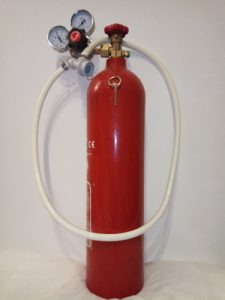
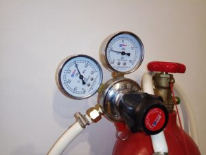
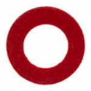
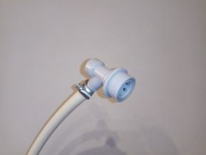
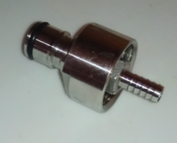

Carbonation in beverages happens by two major means. Champagne, Cava and other beverages using the name Champagne, such as Soviet Champagne and California Champagne undergo two fermentations. In the first fermentation in a vat the yeast present in the grape juice creates alcohol but the resulting CO2 byproduct is allowed to disperse into the air. Then the beverage is bottled and tightly corked and a second fermentation (Bottle fermentation) creates more CO2 that is now trapped in the bottle. With correct control this will be enough to pressurise the bottle, carbonate the beverage and not be quite strong enough to shatter the bottle if it’s correctly handled.

A second, more common way of carbonating beverages is to apply pressurised CO2 from a tank to the beverage in a sealed container, possibly chilling and agitating the beverage at the same time. This is how sparkling wine, carbonated water, beer and soft drinks are carbonated.

Water, naturally, cannot be carbonated by fermentation, as it would no longer be water but can be carbonated at home by applying CO2 from a tank. You can buy machines to do this on a small scale at significant operating expense, or you can take a pragmatic and cost-effective approach and build your own more versatile rig which is also a better conversation point.

The home carbonation rig described in this article costs less than €100 to build, half of which is for purchase of the 5Kg CO2 tank which will carbonate about a bathtub of water. After leakage is factored in, this is still months of use, and can be refilled for €11 at the time of writing, resulting is a very favourable running cost.

In essence you have a strong metal tank containing CO2 in liquid form. It remains liquid because it is contained in the tank. The liquid evaporates within the tank until the vapour pressure of CO2 is achieved in the top of the tank. When CO2 is released, a little more liquid evaporates to restore the vapour pressure. The vapour pressure can be as high as 6 MPa (Megapascals) in a hot room, and this is quite significant. You would not want to vent this accidentally and if you put this pressure in a plastic bottle you will cause it to explode. Rather you would like to transfer 0.4 MPa (4 bar) of pressure into the container also containing the beverage to carbonate. This is what the regulator is for. The high pressure side will teeter around 4 to 6 MPa depending on the temperature of the cylinder, but the knob can be used to adjust the low pressure side to about 4 to 5 bar which is quite sufficient to carbonate water and do a decent job of other beverages if they are chilled.

The remainder of the rig is tubing, connectors, clips and a bottle as listed below. Here is a full list of requirements:

## Protective Eyewear

In your local hardware store, or on EBay, pick up a pair of eye protection goggles for assembling, testing and operating your rig.

## Carbon Dioxide Cylinder

As homebrew is an increasingly popular pastime, people who make beer at home need a way to carbonate it, and wherever they are sourcing their CO2 gas, you can use the same supplier. Also Paintballing requires pressurised CO2 and it is used in aquaria. Fire suppression companies and welding suppliers are a good option too. After that a friendly publican may allow you to switch out one of his cylinders. Commercial gas companies usually will not deliver to your home, but may to a business.

On the offchance you have a choice between gas offtake and liquid offtake tanks, you must choose the gas offtake. A liquid offtake tank has a tube inside that dispenses liquid CO2 when standing upright and you absolutely do not want this. If necessary inform your supplier that the tank is for homebrew/beverage use.

AJ Edge in Bray will sell you a 5 kg cylinder for €45 euros and refill it for €11 at the time of writing. This will carbonate many hundreds of litres of water.

## CO2 Regulator

You need a regulator specifically for CO2. I don't believe you can use a regulator intended for other gasses and it won't fit onto the tank. Your regulator needs to go to a minimum of 4 bars. A safety valve will release excess pressure over about 4.5 bars. You may get a regulator and valve that goes higher, but you don't need more than 4 bars to carbonate chilled water very strongly. Higher pressure is an advantage when carbonating alcoholic beverages or those containing sugar.

## Fibre Washer

CO2 will degrade rubber washers so you need either nylon or fibre washers, both can be found in DIY stores like Woodies with the water/gas plumbing supplies. Fibre is typically red and nylon is typically white. Black washers are nearly always rubber and cannot be used.

This washer is very important, because it goes on the high pressure side of the regulator, where you really want to get things right. Place it inside the threaded portion of the regulator and carefully screw that onto the CO2 tank, using a wrench to achieve a firm closure without over-tightening.

## Tubing

Because the tubing is used on the low pressure side of your regulator, any strong food-safe plastic tubing will suffice. You can probably buy this in a DIY shop like Woodies off the reel (Possibly near the chains and other goods sold off the reel.) It is helpful if the tube is transparent as you can then see any fluid that gets into the tube and clean it out. Allow about one metre so you can shake the bottle without having to lift the CO2 cylinder off the ground.

## Screw Band Hose Clamps

Standard plumbing hose clamps of appropriate size from any hardware store.

## Keg Connector for the Gas-In post

You can buy this from China or order it from a bar supply shop. If possible get a decent quality one as it's annoying if it leaks or is otherwise substandard, and if it breaks your rig is out of commission so you might keep a spare. You can get one shipped from The Homebrew Company in Mountmellick, Laois. Make sure you order a Gas-In, which is usually light grey, not a Beer-Out variety that fits on the other side of a keg and is usually darker or black and no use for our purpose.

## PET Bottle Carbonation Cap

You can order these from China with good success. They screw on to the top of a standard 1, 2 or 3 litre bottle, and present the same fitting as a keg Gas-In post to which the connector will clip. Remember you can't take them off the PET bottle without releasing the pressure, so buy a few and they will last some time.

## PET Bottle

You can reuse any 2 litre PET bottle that was sold with carbonated water or beverage within. Check that it has a standard opening that will fit your carbonation cap. It is also useful to have a 1 litre bottle for carbonating smaller quantities of water or alcoholic beverages like white wine. 1 litre bottles often contain tonic water. Don't try to use a bottle that has ridges or is soft such as those that contained still water.

# Assembly

Once you have all the pieces, attach your gas-in clip to your tubing and connect that to the low pressure side of your regulator as in the picture. Make sure to slide your hose clamps onto the tube before connecting them up or you'll have to start again. Then tighten the hose clamps well at both the clip and regulator ends.

Attach your regulator to the tank, being sure to place your fibre or nylon washer inside this connector or it will definitely leak CO2. Leaking CO2, particularly on the high pressure side of the regulator will cause the metal connectors to become very cold and, if touched, will cause nasty skin damage and a freezing burn. So check carefully by listening from a safe distance that there is no leak at the fibre washer when the tank is first turned on.

Turn your regulator valve anticlockwise to turn off the pressure (This will give the impression of opening or loosening) and check all your connections on both sides of the regulator. Place the tank in a safe location, bolstered against a wall etc, preferably outside, and open the main tank valve.

Your high pressure dial will go upto 4 MPa or so depending on how hot the tank is, but your low pressure side should stay at 0 if your regulator is off. Listen carefully for leaks without getting too close until you have confidence in the seal. You can use soapy water if you suspect a leak. Apply it to the connections and look for bubbles.

Now slowly pressurise the low pressure side of the rig to 4 bar by turning the regulator dial clockwise, tightening it. Again listen for leaks.

If the dials read the correct pressures, as in the picture above, and there are no leaks then turn off the main tank valve. Both the low and high pressure needles should **remain where they are** indicating that the seals are good on both sides. They will eventually go down to zero but this should take 10 minutes or so if the seals are adequate. If both dials go down within a minute or less then the seals may need checking.

Turn your rig off **at the main cylinder valve** until you are ready to use it.

# Tank Connections

One thing you may learn during this project is that tank and regulator fittings are a harsh mistress and the high pressure side of your rig may not fit together perfectly at first. This happened to me, and it may be because I sourced the regulator from China so it was too big to fit on the tank. I had to have a friend "Adjust" the fitting by carefully sawing part of it off and filing the surface.

# Method

Fill your bottle about 75% full of fluid, say **cold** water. Place the carbonation cap on top but do not tighten. Squeeze the bottle until nearly all of the air is removed from the top and tighten the cap. This means that the only gas in there will be CO2, this helps with carbonation.

Attach the gas clip to the carbonation cap post by lifting the skirt of the clip and snapping it on. Then put the bottle down or in the sink where any failure of the bottle will not cause you harm. Ensure the regulator is at a low setting and turn on the main CO2 cylinder valve. This main valve performs no regulation (There is no fast of or slow) so pressurisation is immediate.

Check the regulator dial for the low pressure side and adjust it to 4 bar (0.4 Mpa), a good pressure for carbonating water.

The bottle will now be pressurised quite dramatically and quite hard, if not then something is wrong, check your regulator dials and connections.

Lift the tubing upward so that the water cannot flow into the tube then shake the bottle for about 30 seconds. You will see the low pressure dial go down as the water absorbs the CO2 and then spring back up as the pressure is restored from the tank with a satisfying hiss. After some shaking the bottle this will stop and you will hear no more CO2 entering the bottle, nor will the low pressure dial bounce around on shaking, and at this point you may stop shaking because the water is absorbing no more CO2.

Lift the skirt of the gas clip and snap it off. If you are done with the rig, then turn off the gas at the main cylinder valve. The regulator will remember its setting for next time if not turned, so next time you'll get a 4 bar setting instantly.

The water can be used now as it is carbonated. If you like you can use your fridge or freezer to reduce the temperature further, and it will then take more CO2 on repetition of the process. But even now, the water will be very good.

Carefully open the carbonation cap and pour the water gently into a glass, tilting the glass to avoid shocking the CO2 out of the water.

Consume.

Replace the carbonation cap on the bottle, and if desired, re-pressurise the bottle from the rig so it will be just as good when you next open it.

If you are taking the water away from the rig, keep it cold and try not to open the bottle more than two or three times as thereafter the water will not be as fizzy.

To carbonate wine you will have to work a little harder because of the sugar and alcohol content. 750 ml of wine fits perfectly in a 1 Litre bottle such as that tonic water comes in. Make sure it is very cold, and shake well during carbonation. Repeat the procedure. This will be as good as any sparkling wine you buy, subject of course to the quality and suitability of the wine with which you started.
