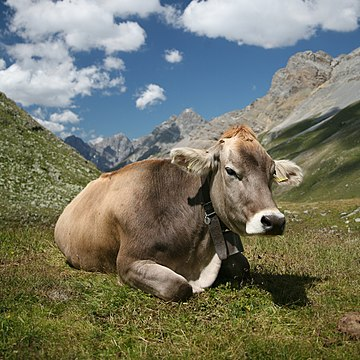
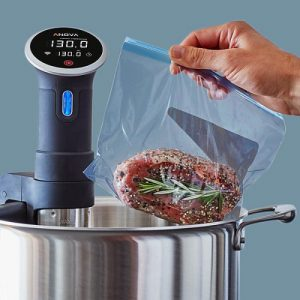
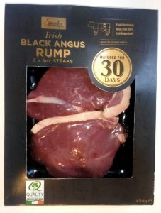
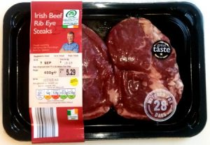
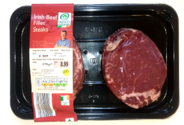
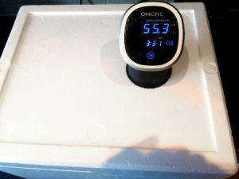
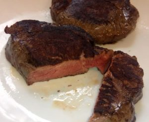
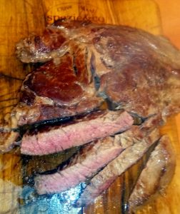
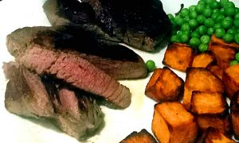

In the Country they don’t call them cows: cows are just for milk, what we eat are heifers or bullocks (That’s not a rude typo, it’s a kind of cow.) However to those of us who don’t wear wellies to work, they’re cows, and they’re tasty, and in modern Ireland you can buy them in Aldi.

\[caption id="" align="alignnone" width="360"\] A Cow\[/caption\]

It’s only been a year since I was informed in conversation of the delights that awaited me in in the Aldi beef fridge. I was sceptical because when I was young we got really good steaks in a butcher or maybe Superquinn, but the world moves on, so I gave it a try.

I routinely shied away from cooking steaks because they’re kindof difficult to get right unless you want them well done. My attempts were regularly a lot more tough than desired and I envied chefs in restaurants, and even some of the less pretentious gastropubs their skill in cooking tender medium steak. It always puzzled me how I couldn’t source those cuts and bring them to fruition.

Now that I’ve discovered the Science of Sous-vide and its application to cows I can attest that it’s not so difficult after all. For those who unhelpfully say that Sous-vide is out of fashion I have nothing but contempt, you can be a victim to fashion if you like, but cows are still _**in**_ fashion, and it’s really all about that for me.

# The Basic Process

Get a steak. If it is not already vacuum packed then make it so or put it in a sealed ziplock bag with the air expelled. (You do this by zipping the bag to within an inch of the end, dipping everything but the open part in the sous-vide bath to expel the air, and then completing the seal and hoping for the best.)

Sous-vide at 54.4 degrees Celsius for anything from 1.5 to 8 hours. If you consulted your pasteurisation chart and did the Science right then the steak is now pasteurised and safe to eat, though not appetising looking.

Chill in the fridge for a while.

Unseal, dry off, and sear in a little oil on a pan or contact grill for only a few minutes.

I’ve left the numbers rather vague here because this isn’t a recipe, it’s just to give you a basic feel for the direction most recipes take. Many don’t require the chilling step after cooking, and we’ll discuss that later. The 54.4 degrees comes from the minimum temperature you should sous-vide beef at to ensure that the bacteria die (Causing pasteurisation and yumminess) instead of culturing (Causing barfing and ruined friendships.)

# The Experiment

So which steaks work best, if at all, and what times are we looking at? That’s really all we’re out to answer here.

Here’s three types of steak, chosen quite randomly from the meat section of Aldi in Sandyford. (Sticky gold stars, compression underwear and hedge trimmers were also on sale, but those are not the topic of this post.)

    

They’re all going to be sous-vide-ed at 54.4 degrees in my trusty and environmentally sound polystyrene box sous-vide container. I say environmentally sound not because the the polystyrene is recyclable, that’s a feat beyond us here in Ireland, but rather because it keeps the heat in so it can run for a long time without wasting electricity. Today we’ll just do 6 hours. The cows also aren't environmentally sound, I've been reading lately too.

So 6 hours then, why 6? Well no earth-shattering reason but I want to ensure that the effect of the sous-vide process is very evident, even exaggerated, in the finished product so that scoring and review brings forward differentiated findings rather than three instances of 5 out of 10. Also I want the meat very soft, that’s my objective and I’ve found that one has to bite the bullet to get results with sous-vide, be brave or go home.

After 6 hours at 54.4 degrees they all look pretty unappetising, this is normal.

# The Chill

If you take your steak from the sous-vide machine, unseal it and sear it straight away the centre of the steak can easily go from about 50 degrees (Lukewarm) to hot again while the outside is searing, and then you’ve not got a medium-rare steak anymore.

Now here’s the thing I discovered quite by accident. You’re cooking 6 steaks, you’re not going to eat them all tonight right? Neither was I so I chilled them. They’re pasteurised so I left them for quite some time in the fridge unopened.

When I unsealed and seared the chilled steak, the centre goes from about 5 degrees to about 55 degrees in the course of a few minutes searing. A primary lesson in sous-vide is that the temperature of the meat dictates its doneness, not the duration of the cook (This is the Science part) so you really want to avoid the centre of the meat going much over 55 degrees because then you’re changing the doneness, and that’s not something you want to do at least not accidentally.

So that’s why you chill the steak between cook and sear. That way the outside can sear without changing the doneness of the steak inside, which will still be medium-rare if seared on a hot grill for not more than a few minutes.

And of course, if you actually wanted medium, or medium-well then you would have set your sous-vide machine to an appropriate temperature to begin with.

# The Sear

Ideally you want to get a Maillard Reaction on the outer 1 mm of meat to make it appetising in appearance and contribute texture and flavour only to the outside of the steak, leaving the inside unchanged. Because the inside is cold this is easier, and you are allowed to insert your thermometer if you really must.

The meat was seared for a few minutes at 220 degrees Celsius with a little oil on a cast iron contact grill.

Each of the three steak varieties, each numbering two steaks were tested, and these are my very subjective results.

# The Fillet

The Fillet was subjectively “Very Good”, or 8 out of 10 based on my experience of cows to date.

The Fillet has the advantage that there is a large chunk of meat in the centre and no heavy marbling making dissection easier. Flavour was as good as any fillet, and softness was excellent. This was a very nice steak.

# The Rib Eye

The Rib Eye was less successful. It rated “Partial Success” or about 5 out of 10. While the flavour and texture of the meat was good, slightly softer than the thicker Fillet, there was a problem with this. The Rib Eye had heavy marbling running through the meat. A 6 hour sous-vide made this fat very soft, and so it was difficult to dissect the steak. The overall effect was less appetising. It might appeal more to the diner who religiously eats the entire steak including all fat, but for me it was squashy.

A 4 hour sous-vide might be worth a try for the Rib Eye, but since I generally cut around the fat I’m probably not going to hurry to sous-vide steak with large distributed fat marbling again.

# The Rump

The Rump Steak has a good texture, still with a good bite after 6 hours in the bath. It isn't a winner on flavour though, surprisingly. I'd say 6 out of 10. It proves an inexpensive cut with good results and the correct amount of fat for sous-vide cooking but the fillet has beaten it on flavour and impact.

# The Winner!

The Fillet, hands down was a great steak. It wins out on fat distribution, flavour, texture, suitability for sous-vide and overall impact. The Rump is a close second that could happily grace a dinner table also. The Rib-Eye has the wrong distribution of fat.
